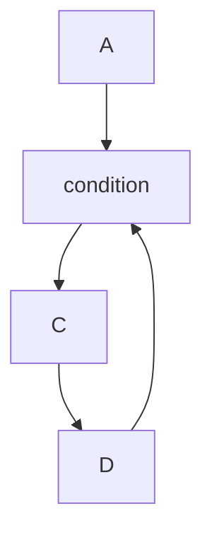

```js
// for (/*initialize*/; /*condition*/; /*update*/) {  
  /* code to execute*/}
for (num = 1 ; num < 6 ; num++) {
  console.log(num)
}
```


```mermaid
flowchart TD
    A --> condition
    condition --> C
    C --> D
    D --> condition
```
