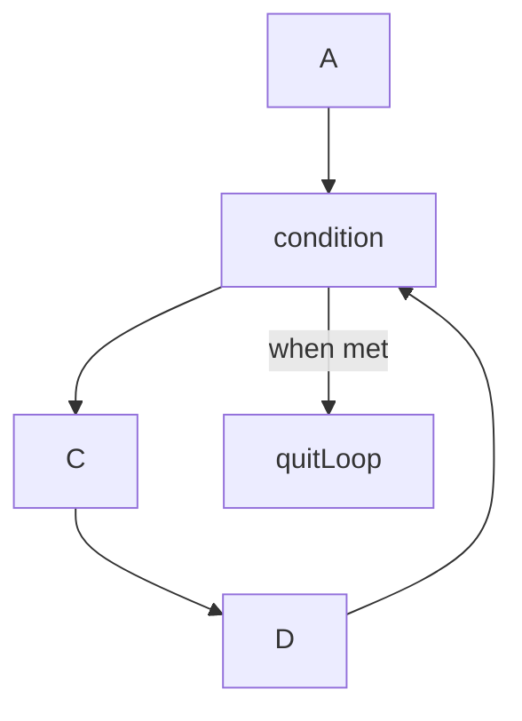

# Java Script Intro

Java Script is not the same as Java!

It started as a way to control the behaviour of a website and has expanded into numerous use cases with several several frameworks and libraries built upon it.

The current implementation is ES6 which provides new ways to use it more efficiently. Most of the web is based on JS and trying to change or fix bugs in Javascript would effectively break the web. 

Therefore a lot of the older javascript implementations still work and you'll find references to old code and standards all over the web (for example defining a variable with var when const & let supersede it.)

Resources: 

* https://javascript.info/
* [Day 1: introduction & Terminal - sei 60 gitbook!](https://sei-60-git-book.gitbook.io/sei-60-git-book/week-1/day-1-introduction-and-terminal)
* https://jsfiddle.net/

#### Type Script!

[Typescript](https://www.typescriptlang.org/docs/handbook/intro.html) can be considered a flavour of Javascript. It improves on issues that Javascript has inherited such as missing errors in code because it is compiled in the browser. ## Tools and useful debugging tricks

### Code Editor (VS Code)

- Can create a boiler plate for HTML files with '! and TAB'
- Can use 'lorem' to generate place holder text
- Use control k to comment out multiple lines of code (vs will use a single line comment // on each line instead of commenting out multiple lines with /* */)

### Chrome Inspector

```
CTRL + SHIFT + J (Opens up chrome inspector)
```

The inspector is a powerful tool that lets you find out what is happening on the backed of a website. Using the console tab will help debug javascript errors. 

### Java Script Debugging

```js
console.log('Will be logged to console') // Will show hello on the console
alert('This is an alert') // shows a popup with the value
let input = prompt('How are you today?') /* If a variable is defined, 
will save user user input e.g. input = what user typed */
console.log(input)
console.log(typeof input) // will show the type (datatype) of an object
```

## Sandbox

Execute Javascript code easily with https://jsfiddle.net/ (free) or [PlayCode - Javascript Playground](https://playcode.io/javascript) (paid)

Remember to console log your code when playing around! Otherwise you won't see it in the console. 

## Data Types

### Javascript Primatives

*SQ* What is a javascript primative

> In [JavaScript](https://developer.mozilla.org/en-US/docs/Glossary/JavaScript), a **primitive** (primitive value, primitive data type) is data that is not an [object](https://developer.mozilla.org/en-US/docs/Glossary/Object) and has no [methods](https://developer.mozilla.org/en-US/docs/Glossary/Method) or [properties](https://developer.mozilla.org/en-US/docs/Glossary/property/JavaScript). There are 7 primitive data types:

- [string](https://developer.mozilla.org/en-US/docs/Glossary/String) - basically text
- [number](https://developer.mozilla.org/en-US/docs/Glossary/Number)
- [bigint](https://developer.mozilla.org/en-US/docs/Glossary/BigInt) Allows for Arbitrary-precision arithmetic
- [boolean](https://developer.mozilla.org/en-US/docs/Glossary/Boolean) A true or false value
- [null](https://developer.mozilla.org/en-US/docs/Glossary/Null)
- [undefined](https://developer.mozilla.org/en-US/docs/Glossary/undefined)
- [symbol](https://developer.mozilla.org/en-US/docs/Web/JavaScript/Reference/Global_Objects/Symbol)

[Primitive - MDN Web Docs Glossary: Definitions of Web-related terms | MDN](https://developer.mozilla.org/en-US/docs/Glossary/Primitive)

#### Common Data Types

#### Numbers (primative)

```javascript
console.log(Infinity) // => Infinity
console.log(NaN) // Not a number, is often seen when a string hasn't been
// parsed into a string properly 
console.log(100_000_000) // underscores can be used to make numbers 
// more human readable, they will be ignored by a compiler 
// console will report this as 100000000
```

#### Null (primative)

```javascript
console.log(null) // convention is to use it as a place holder that will set another variables
// technically and object and can break the web if changed
```

#### strings

Strings be used by enclosing text in ' " or `e.g console.log('I am a string') console.log("I am a string") console.log(`I am a strong`)

## Array

- A data type that contains more elements (aka as lists in other languages)
- arrays are initialised with [] and elements are separated by commas ,
- arrays are ordered lists, starting with 0 (js is a 0 based index)
- you can determine the amount of elements by using the property .length
- If you use let with an array it can be overridden
- JS doesn't care about types and can contain strings and numbers (opposed to other languages that need you to define if it will have numbers etc)

```js
const dinner = ['rice', 'curry', 'beans']
console.log(dinner[1]) // ouput would be curry
```

## Objects (complex data types)

https://javascript.info/object

Generally anything that isn't a primative is an object in js

## Variables

There are three types of variables:

* var - out of use

* let - denotes a variable that will change in the future

* const - a variable that can only be declared once (however the data in it can still be changed)

```js
let sample = fail
sample = true // will reasign the variable to true
const example = 'first example'
example = 'new example' // Won't work because it was previosuly defined
```

#### Rules in naming Javascript variables

* Can contain alphanumeric, dollar sign or underline but not any other special characters such as dash -

* Can not start a variable name with a number

* Can not use a JS reserved words such as let. See [JavaScript Reserved Words](https://www.w3schools.com/js/js_reserved.asp)

#### Parts of a variable

*SQ* Making a variable , how to make a variable , how to create a variable

```javascript
let blah // Step one: decoration
blah = 'A value' // Step two: initialise value
```

## Operators

### Binary Operators

Needs two values in order to work

### [Arithmetic operators](https://developer.mozilla.org/en-US/docs/Learn/JavaScript/First_steps/Math#arithmetic_operators)

Arithmetic operators are the basic operators that we use to do sums in JavaScript:

| Operator | Name                                | Purpose                                                                                                                           | Example                                                               |
| -------- | ----------------------------------- | --------------------------------------------------------------------------------------------------------------------------------- | --------------------------------------------------------------------- |
| `+`      | Addition                            | Adds two numbers together.                                                                                                        | `6 + 9`                                                               |
| `-`      | Subtraction                         | Subtracts the right number from the left.                                                                                         | `20 - 15`                                                             |
| `*`      | Multiplication                      | Multiplies two numbers together.                                                                                                  | `3 * 7`                                                               |
| `/`      | Division                            | Divides the left number by the right.                                                                                             | `10 / 5`                                                              |
| `%`      | Remainder (sometimes called modulo) | Returns the remainder left over after you've divided the left number into a number of integer portions equal to the right number. | `8 % 3` (returns 2, as three goes into 8 twice, leaving 2 left over). |
| `**`     | Exponent                            | Raises a `base` number to the `exponent` power, that is, the `base` number multiplied by itself, `exponent` times.                | `5 ** 2` (returns `25`, which is the same as `5 * 5`).                |

### Special Operator

#### The modulo operator %

Checks the remainder of a number and can be used to determine if it is even or odd. Simply divide a number by 2 and if it equals 0 it is even. Commonly used in interview style problems.

*SQ* find remainder , find odd or even 

```js
console.log(13 % 5);
// expected output: 3

console.log(-13 % 5);
// expected output: -3

console.log(4 % 2);
// expected output: 0 | Note this is even

console.log(-4 % 2);
// expected output: -0 | Suprisingly doesnt become NaN, Undefined etc
```

## Escape characters

These are used to signal that a string needs to be processed in a certain way. The \ is common to create white space and escape characters that would otherwise break your code.

[String - JavaScript | MDN](https://developer.mozilla.org/en-US/docs/Web/JavaScript/Reference/Global_Objects/String#escape_sequences)

*SQ* escape characters

```js
const message = 'What's up' /* note an single apostrophe within an 
apostrophe will not work  */
const messageescape = 'What\'s up' // THe \ escape the 'allowing it to work
const messagedouble = "What's up" // alernatively you can use " in this case
const message = `Whats's up` // or back ticks
```

## [String interpolation - Wikipedia](https://en.wikipedia.org/wiki/String_interpolation)

Is used to insert variables within a string. Really useful as it avoids the need to concatenate strings. Use ${variable} within a back tick string to insert the variable

```javascript
// Without interpolation
const thisis = 'string'
console.log("Let's just say" + "this is a" + thisis)
// Output: Let's just saythis is astring
```

```js
const thisis = 'string'
console.log(`Let's just say this is a ${thisis}`)
// Output: Let's just saythis is astring
// Output: Let's just say this is a string, not interpolation makes it

// much easier to to format you text since it is more natural
```

## Quirky Javascript types

Trying to combine types in javascript can add in some odd results. Types become a big issue when dealing with larger programs and programmers assume they've used a previous type before.

```js
console.log(strnumb = 40 + '2') // is 402, but a string not a number
console.log(typeof strnumb) // string
console.log (notnumber = 1 * 'one') // NaN
console.log(notnumber) // NaN
console.log(intg = 0.1 + 0.2) // number
console.log(typeof intg) // number
```

Note that adding  a number with a string is technically valid, however it converts it into a string. This means mathematical operations will not work on it. Example

```js
console.log(strnumb = 40 + '2') // is 402, but a string not a number
strnumb = strnumb + 1
console.log(strnumb) // Output 4021
console.log(typeof strnumb) // Output String
```

This is a prime reason why TypeScript is becoming much popular since it identifies these errors prior to the code running

```js
let strnumb = null;
let notnumber = null;
let intg = null;

console.log(strnumb = 40 + '2') // is 402, but a string not a number
console.log(typeof strnumb) // string
console.log (notnumber = 1 * '2') // NaN  | Type script will throw an error
console.log(notnumber) // NaN
console.log(intg = 0.1 + 0.2) // number
console.log(typeof intg) // number
```

For those who want to learn Type Script, remember it is backwards compatible with Javascript and the online editor https://www.typescriptlang.org/ can give you a clue on how it'll react to your program. 

Typescript is becoming much more prevelantant in the industry and is a useful skill. 

## Comparison operators

Comparison operators are used in logical statements to determine equality or difference between variables or values.

**For x = 5**

| Operator  | Description                       | Comparing                                                                      | Returns | Try it                                                                         |
| --------- | --------------------------------- | ------------------------------------------------------------------------------ | ------- | ------------------------------------------------------------------------------ |
| ==        | equal to                          | x == 8                                                                         | false   | [Try it »](https://www.w3schools.com/js/tryit.asp?filename=tryjs_comparison1)  |
| x == 5    | true                              | [Try it »](https://www.w3schools.com/js/tryit.asp?filename=tryjs_comparison2)  |         |                                                                                |
| x == "5"  | true                              | [Try it »](https://www.w3schools.com/js/tryit.asp?filename=tryjs_comparison12) |         |                                                                                |
| ===       | equal value and equal type        | x === 5                                                                        | true    | [Try it »](https://www.w3schools.com/js/tryit.asp?filename=tryjs_comparison4)  |
| x === "5" | false                             | [Try it »](https://www.w3schools.com/js/tryit.asp?filename=tryjs_comparison3)  |         |                                                                                |
| !=        | not equal                         | x != 8                                                                         | true    | [Try it »](https://www.w3schools.com/js/tryit.asp?filename=tryjs_comparison5)  |
| !==       | not equal value or not equal type | x !== 5                                                                        | false   | [Try it »](https://www.w3schools.com/js/tryit.asp?filename=tryjs_comparison7)  |
| x !== "5" | true                              | [Try it »](https://www.w3schools.com/js/tryit.asp?filename=tryjs_comparison6)  |         |                                                                                |
| x !== 8   | true                              | [Try it »](https://www.w3schools.com/js/tryit.asp?filename=tryjs_comparison13) |         |                                                                                |
| >         | greater than                      | x > 8                                                                          | false   | [Try it »](https://www.w3schools.com/js/tryit.asp?filename=tryjs_comparison8)  |
| <         | less than                         | x < 8                                                                          | true    | [Try it »](https://www.w3schools.com/js/tryit.asp?filename=tryjs_comparison9)  |
| >=        | greater than or equal to          | x >= 8                                                                         | false   | [Try it »](https://www.w3schools.com/js/tryit.asp?filename=tryjs_comparison10) |
| <=        | less than or equal to             | x <= 8                                                                         | true    |                                                                                |

## Truthy vs Falsey

## Functions

Functions prevent you from repeating your code (helps with dry). They can run by itself when called upon, take in inputs and even run functions within functions 

SQ Create a function

```js
const val = `example`
hello = function(val) {
  console.log(`Hello ` + val)
}
hello(val)
```

SQ Create a arrow function

```javascript
const val = `example`
hello = (val) => console.log("Hello " + val)
hello(val)
```

Functions can accept variables that you can reuse in the code, the functions are parsed within the brackets  for e.g (val)

## Accepting Arguments

[Rest parameters - JavaScript | MDN](https://developer.mozilla.org/en-US/docs/Web/JavaScript/Reference/Functions/rest_parameters)  

Technically there is no limit to accepting arguments, though it should be shown that you are accepting more

```javascript
function f(a, b, ...theArgs) {
  // …
}
```

These extra arguments are parsed into an array, where certain methods can be used.

# Control Flow

[Control Flow in JavaScript&nbsp; - Code Institute Global](https://codeinstitute.net/global/blog/control-flow-in-javascript/)

### Conditional's

## Loops

Choosing loops

Be careful when using loops, it's easy to crash a program simply be having a condition that can't be met. In for loops this means setting the condition for something that is impossible such as i = 5 . This is called an *infinite loop*

Make sure to choose a loop that makes sense to the situation. Avoid loops

There are five basic loops in JS:

* [JavaScript for loop](https://codetopology.com/scripts/javascript-tutorials/javascript-loops/#JavaScript_for_loop)

* [JavaScript do….while loop](https://codetopology.com/scripts/javascript-tutorials/javascript-loops/#JavaScript_dowhile_loop)

* [JavaScript while loop](https://codetopology.com/scripts/javascript-tutorials/javascript-loops/#JavaScript_while_loop)

* [JavaScript for…in loop](https://codetopology.com/scripts/javascript-tutorials/javascript-loops/#JavaScript_forin_loop)

* [JavaScript for…of loop](https://codetopology.com/scripts/javascript-tutorials/javascript-loops/#JavaScript_forof_loop)

The most commonly used loops are for, while loops &  for of loops.

Loops are commonly terminated when a condition is met. However a [break](https://developer.mozilla.org/en-US/docs/Web/JavaScript/Guide/Loops_and_iteration#break_statement) statement can force a loop to terminate early (within the intermost enclosing) and the [continue](https://developer.mozilla.org/en-US/docs/Web/JavaScript/Guide/Loops_and_iteration#continue_statement) statment can restart a loop

### For loops

A for loop will run until a condition is met.



See other graphs at [Software Engineering | Control Flow Graph (CFG) - GeeksforGeeks](https://www.geeksforgeeks.org/software-engineering-control-flow-graph-cfg/)

```javascript
// 'For loop' syntax:
for (/*initialize*/; /*condition*/; /*update*/) {  
  /* code to execute*/
}

// Example of a 'for loop':
for (let i = 0; i < 5; i++) {    
  console.log( i );
}
// => 0 1 2 3 4

// ERROR: A simple mistake can turn this into an infinite loop, 
// in this case the update is being reassigned and this will crash the browser
for (let i = 0; i < 5; i = i ++) {    
  console.log( i );
}
// => 0 ... Infinite loop
```

*SQ* Using for loops to show elements in an array

```javascript
let greatPeople = [ 
  "Louis Pasteur", "Jacques Cousteau", "Imhotep", "Sigmund Freud", 
  "Wolfgang Amadeus Mozart" 
];

for ( let i = 0; i < greatPeople.length; i++ ) {    
  console.log( greatPeople[ i ] ); // Logs out the "i-th" element each iteration
}
/* output: Louis Pasteur
Jacques Cousteau
Imhotep
Sigmund Freud
Wolfgang Amadeus Mozart */
```

```js
// Javascript methods extend the functionality of JS an
["Louis Pasteur", "Jacques Cousteau", "Imhotep", "Sigmund Freud", 
  "Wolfgang Amadeus Mozart"].forEach( function (elem, index) {    
  console.log(index + '. ' + elem);
});
// => 0. Louis Pasteur
// => 1. Jacques Cousteau
// => 2. Imhotep ...etc
```

MDN doc: [Array.prototype.forEach() - JavaScript | MDN](https://developer.mozilla.org/en-US/docs/Web/JavaScript/Reference/Global_Objects/Array/forEach)

### While loop

While loops are similar to for loops, the main difference being that it only requires one condition to evaluate to true. Compared to a for loop that also has requires that you initialise the variable and include an update.

```js
​// The equivalent 'while loop' would be:
let i = 0; // This is the 'initialize' value
while (i < 5) { // This is the 'condition' (in the parentheses)    
  console.log(i);    
  i = i + 1; // This is the 'update'
}
// => 0 1 2 3 4
```

While loops will run as long as the statement given is true. However, you tend to have less control of them. They are useful for forcing user input, waiting for input like in games or generating things.

```js
while (true) {
a = 'yes'
input = prompt('input yes to close prompt')
if (a === input) {
break
}continue
}
// will force a user to type in yes or continue getting prompts
// browsers will often allow you to prevent addditional dialogs
```

### For of loops

Loops over an array or other iterable object and allows you to access and use them

```js
let satchel = ['gold','coins','dagger','weed']
for (let element of satchel) {
    console.log(element)
}
```

### Using for of loops in nested arrays

```js
const satchel = [
    ['gold', 'tokens','shiny stuff'],
    ['dagger', 'knife','butter knife'],
    ['sword', 'axe', 'fire']
]
console.log(satchel[1][2])
// Can access an individual item of a nested array
// by first selecting the array and then the item in the nested array
for (let slot of satchel) {
  console.log('Slot: ' + slot)
    for (let item of slot) {
        console.log('Item:  ' + item)
    }
```

# Methods

## Array methods

## String methods
