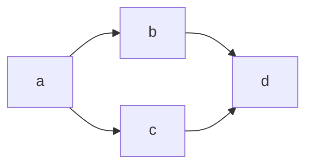

# Course Notes

The course is split into two components, components which are classwork and homework.

## Folder Structure

Home Folder (Jeffrey)

* SEIc60
  
  * coursework
  
  * homework
  
  * notes

## Principles

- Dry (Do not repeat your code )
- Code is made for other humans

Required software for  [SEIC60 Unit 1 Installfest - Windows WSL2 · GitHub](https://gist.github.com/didoarellano/5cb8a0e899363e0264fcdfb1247a8d01)

## Shortcuts for VS Code

code .

# Note taking copy

copying and pasting from various files in coursework into the one thing here:

# Introduction to JS

HTML = Structure
CSS = Presentation of structure
JS = Behaviour

# Diagramming with Mermaid



[Flowcharts - Basic Syntax | Mermaid](https://mermaid-js.github.io/mermaid/syntax/flowchart.html)

# JS Tools

## Chrome Inspector

Can use the console to run JS

## JS broswer tools

alert() // shows a popup with the value
console.log() // shows message in console
prompt('How are you today?') // similar to alert with a pop up box

## VS Code

- Can create a boiler plate for HTML files with '! and TAB'
- Can use lorem to generate place holder text
- Use control k to comment put multiple lines of code

## Sandbox

Easily execute code in a sandbox environment without having to worry about setting anything up. Useful for playing around with concepts on the go and seeing code being compiled in real time.

[PlayCode - Javascript Playground](https://playcode.io/javascript)

# Javascript (consilidate into main-js.md file)

## Data Types

- Text/Strings
- Numbers e.g console.log(42 + 42)

the typeof function can be used to determine the type of

## Primitive (basics)

### strings

- strings be used by enclosing text in ' " or `e.g **console.log('I am a string') console.log("I am a string") console.log(`I am a strong`)
  **

### numbers

special numbers
console.log(Infinity)
console.log(NaN)
console.log(100_000_000) // underscores can be used to make numbers humman readable

### boolean

Can only be true or false

console.log(true)
console.log(false)

### undefined

console.log(undefined)

### nulll

console.log(null) // convention is to use it as a place holder that will set another variables

// technically and object and can break the web if changed

## Container (more complex)

# Variables

3 types const, let and var
const firstName = 'Tonto'

Const is only used for constats otherwise it wont be able to be changed later on

let can be used for things that change

Generally use const for things

## rules for js variables

alphanumeric, dollar sign or underline

cant start a variable name with a number

cant use js reserved words such as let. See [JavaScript Reserved Words](https://www.w3schools.com/js/js_reserved.asp)

## Parts of a variable

1. decelration e.g let blah
2. initialise value e.g. blah = 'example'

# DRY principle

Don't repeat your code

# Operators (e.g. + or minus) are binary types that need to values

e.g (21 * 23)

## Special operators

% = checks for remainder and can be used for even/odd
0 is even

# Escape characters

can use \ to create white space and ensure that a ' within a string doesnt blow it up

# ' using backticks for adding variables within one string (without concatinating) and anything else that returns a value

[String interpolation - Wikipedia](https://en.wikipedia.org/wiki/String_interpolation)

const dogname = 'dabbs'
console.log(`Good boy ${dogname}`)

## JS error testing

type error means its the wrong variable type

### Operational issues

console.log(40 + '2') // is 402
console.log (1 * 'one') // NaN

console.log(0.1 + 0.2) // since all numbers are a float in js it will technicaly be something a bit different

## Control flow

Goes from top to bottom normally. There are ways to determine where it changes depending on conditions.

[if...else - JavaScript | MDN](https://developer.mozilla.org/en-US/docs/Web/JavaScript/Reference/Statements/if...else)

## Flow charts

diamond = decision

Map it out by diagraming it

### conditional statments and looops

### Loose equality

console.log(age == '32) // result true

console.log(age === '21') // best to use strict equality

- Checks the values and data types // result false

## logical operators

### binary

&& AND

|| OR

# univary

! / is not equal to

console.log(!(42 > 40))

## Don't use mathematical functions for precise finacial calculations

can use a library instead.

Functions

## Creating names

- Follows the same rules as variables (alphanumeric)

## Creating a function

```js
const way2_calculateTax = function () { // a scope is created when the curly brackets are made
    const tax = 40000 * 0.12
    console.log(tax)
}

way2_calculateTax() // calls function also known as execute or invoke
```

### Parameters and Arguments

```
function demo = function (parametter) {}
demo(argument)
```

### Functions behaviour

Hoisted functions

- happens during a regular function

Will move the function to the start of the script (functionaly)
So you can call it anywhere in the program

Function statments can be overwitten by other functions (regular functions not const functions

Const are block scopes (no leackage of variables))

```js
if(true) {
    function leaky () {
        console.log('leaks out the block')
    }
    const function noLeaky = function () {
        console.log('no leakage)
    }
}

leaky()
noLeaky()
```

## Loops and operators

[[[https://developer.mozilla.org/en-US/docs/Web/JavaScript/Reference/Operators/Increment]]](https://developer.mozilla.org/en-US/docs/Web/JavaScript/Reference/Operators/Increment%5D%5D)

```js
let num = 100
num = num + 1
num = num + 1
// ++ Is a increment operator
num++ // A uni operator that only works on what operator, it is a posfix operator 
console.log(num)
num++
// -- Is a descrment opperator

// compound addition assignment (takes a variable and adds the number to it)
num += 5
console.log(num) // will = 105
// similar thing for -
```

## For loops

```js
for (initialisation, conditon, increment/decrement) {
    do stuff
}
```

- Initalisation only happens once.
- Conditional checks if the variable meats the condition till it is false
- the incriment/decrement loops till the condition is false

### Infinite loops

If trying to meet a conditional that can't be evaluated, it may stuff it up

## for vs while loops

### while loops

- Are more dangerous as its easier to enter an infinite loop
- Can be useful if your not sure about what a value is or in games where your asking for input, generating stuff etc

```javascript
let gameOver = false
while (!gameOver) {
    let userInput = prompt('Quit (y/n)')
    if (useInput === 'yes') {
        gameOver = true
    }
    console.log('keep doing game stuff')
    // 1000 lines
}
```

```js
while (true) {
    let quit = confirm(' Do you want to quit')
    if(quit) {
        break
    }
    console.log('Keep playing')
}
```

```javascript
for (let i = 0; i <= 20; i++) {
    if (i % 3 === 0) {
        continue
    }
}
console.log(i)
```

# Array data types []

- A data type that contains more elements (aka as lists in other languages)
- arrays are initialised with [] and elements are separated by commas ,
- arrays are ordered lists, starting with 0 (js is a 0 based index)
- you can determine the amount of elements by using the property .length
- If you use let with an array it can be overridden
- JS doesn't care about types and can contain strings and numbers (opposed to other languages that need you to define if it will have numbers etc)

## let vs const

```
let satchel = [
    'gold'
    'coins',
]
console.log(satchel) // gold and coins
let satchel = [
    bag, 
]
console.log(satchel) // you've lost your bag
```

## indexes

```js

```

## looping an array (for loop if access to index #'s are neded)

```
for (let i = 0; i < satchel.length; i++>) { // never assume the length of an array
    console.log(i)
    console.log(satchel[i])
```

You can not assume that start of an array

- To get the last item in an array
  
  ```
  console.log(satchel[satchel.lenght - 1])
  ```

## the for .. of loop (prefered if you only need access to the elements)

```
for (let element of satchel) {
    console.log(element)
}
```

### checking for arrays

- can't use typeof because it'll return it as an object instead of an array

# Nested arrays

An array within an array

```
const pairs = [
    ['Harold', 'Kumar'],
    ['Ren', 'Stimpy']
]
console.log(pairs[1][1])
```

- Can set array elements with same syntax

## looping nested array

```
for (let pair of pairs_ {
    for (let character of pair) {
        console.log(character)
    }
}
```

- A common thing in tests is nested arrays within nested arrays
  
  ```
  for (let pair of pairs) {
    for (let characer of pair) {
        console.log{character}
    }
  }
  ```

# JS Objects

- objects give meta info
- Using curly brackets create objects (when allocated to a variable it is not a code block
- Can be any data type or object
- Has a kay: value pair

```
let wolfy = {
    name: 'wolfy',
    species: 'wolf',
    age: 16 // can be any type of data
}
```

## Accessing nested data

- will need a mix of bracket and . access
  
  ```
  console.log(car.colours[0])
  console.log(car.engine.hp)
  console.log(car.engine.sounds[2])
  ```

## looping over objects

- can use for in (instead of for of for arrays) to loops objects
- use the type of data to access the right infomation

```
for (let propertyName in car) {
    console.log(PropertyName)
    console.log(car[propertyName])
    console.log(car.propertyName) // this wont show the proper thing, because its looking for something called property name within car. use bracket access and target the thing properly
}
```

- Can use key to get the property values or specfic values of the property
  
  ```
  console.log(key)
  console.log(car[key]])
  ```

## test if an earry is an arry

typeof

# Strings, Arrays & Higher order functions

## String Methods (JS)

```
console.log = ' tonto   '
console.log(name.length)
console.log(name.trim().length)
```

- Need to use trim to remove backspaces otherwise it will count the white spaces
- Reading docs is important e.g 
  [[https://developer.mozilla.org/en-US/docs/Web/JavaScript/Reference/Global_Objects/String/trim]](https://developer.mozilla.org/en-US/docs/Web/JavaScript/Reference/Global_Objects/String/trim%5D)(MDN Docs)
- Should know if something returns or modifies a value
- Syntax shows the other forms (in mdn docs) and arguments
- browsers tend to treat js more or less the same, as opposed to css which is a bit tricker
- keep in mind what it returns

```
console dog = 'Tonto is a good boy!'
console.log(dog.endsWith('!', 5))
```

## Useful methods

- [String.prototype.includes() - JavaScript | MDN](https://developer.mozilla.org/en-US/docs/Web/JavaScript/Reference/Global_Objects/String/includes)
- replace()
- split([String.prototype.split() - JavaScript | MDN](https://developer.mozilla.org/en-US/docs/Web/JavaScript/Reference/Global_Objects/String/split))
- String methods tend to be easier then array methods
  *.at()

```
const geneString = 'rock rap pop punk country'

const gene = geneString.split
console.log(geneString.split(' '))
console.log(gene)
```

## Other methods

- slice can be used to copy and paste

## Methods to use with caution

- shift
- unshift

# Method defintion

- Methods are functions that are defined to objects
  
  ```
  const obj = {
    name: x,
    bar: function() // how methods at
    x: split()
  }
  ```

# Array methods

- [Array - JavaScript | MDN](https://developer.mozilla.org/en-US/docs/Web/JavaScript/Reference/Global_Objects/Array)

## mutate (array will be changed directly)

### Adding to an array

Can make a variable and then add it or use push

Use pop to remove last elements

## immutable (wont change the array)

x

# Higher order functions & call back

- calll a function within a function

```
const fn1 = function () {
    console.log('hi from fn1')
}

const fn2 = function (param) {
    console.log(typeof param)
}
fn2(fn1) // has the reference to the function itself
```

```
const fn1 = function () {
    console.log('hi from fn1')
}

const fn2 = function (param) {
    param() // a call back function
}
```

- Important to understand that a lot of third party libraries expect a function
- Example of this is having a button that is assigned a function to run the function

```
fn2(function) () {
    console.log('Hello from annonymous function')
}
```

- Annonymus function: Generally used as a oneoff function

## Use case for map function (more array stuff)

[Array.prototype.map() - JavaScript | MDN](https://developer.mozilla.org/en-US/docs/Web/JavaScript/Reference/Global_Objects/Array/map)

e.g one method using for of

```
const fruits = ['apple', 'banana','mango,'avo'] {
    let cappped = []
    for (let fruit of fruitsArray) {

    })
}

arrray.forEach
```

### new loop (for each) + array method

```
const fruits = ['apple', 'banana','mango,'avo']
```

[Array.prototype.forEach() - JavaScript | MDN](https://developer.mozilla.org/en-US/docs/Web/JavaScript/Reference/Global_Objects/Array/forEach)

### map

babab.map

## Declerative vs Procedural vs Impertive (setup by steup)

Decelerative: Tells Javascript what to do

let upperCasedFruits = fruits.map(upperCaseFruits)

// creates the array

### filter method

[Array.prototype.filter() - JavaScript | MDN](https://developer.mozilla.org/en-US/docs/Web/JavaScript/Reference/Global_Objects/Array/filter)

Uses truthy and faly to determine if it should show (from return)

return

## real work example

```
const cities = [
  { name: 'Sydney', population: 5000000, landMarks: 10000 },
  { name: 'Melbourne', population: 4800000, landMarks: 9000 },
  { name: 'Adelaide', population: 1300000, landMarks: 2000 },
  { name: 'Manila', population: 1800000, landMarks: 2500 },
]
```

- can use map to grab a bunch of city names without creating a looop
  
  ```
  const cityName = cities.map (function (city)) {
    return. city.name
  }
  const mCities = cities.filter (function () {
    return city.name.startsWith('m')
  }
  ```

Using map function or map function can be combined with string methods to find sotuff

# HTML

- Giv# HTML
  
  - Gives meaning semantic to structure
  
  - Composed of elements denoted by tags
  
  - Some elments will look the same as any other tag if no attributes are given
    
    ```
    <a>
    a
    </a>
    ```
  
  - No attributes will show an aper tag as just text
  
  - Atrributes are space seperated

```
Paragraphs
```

## Structure

- IS defined by nesting tags
  
  ```
  <em> - ephasis tags </strong> - Bold
  <strong>Text HEere</srong> - Italics
  ```

## HTML element

```
* <html lang="en">
* <meta charset="UTF">
```

- can only have head and body tag within in it

- head is for meta data that you dont want to render

- [HTML: HyperText Markup Language | MDN](https://developer.mozilla.org/en-US/docs/Web/HTML)
  
  # Types of tags

- Empty tags : Tags that are self closing e.g.  
  (technically the final tag is not needed but this syntax is better since its needed for react)

- Content tags: Will have things within them
  
  # Image tag

- Alt attributes can be used by screen readers to hear the content.

- okace holder images (can use place img)

- [https://placeimg.com/](https://placeimg.com/)

- [https://placeholder.com/](https://placeholder.com/)
  
  # Inline vs Block level elements

- In inspector: block level has margin (orange)

- In insectpr: blue

- Block level elements can contain other block level elements

- Validator will check if nesting is valid or not
  
  tags
  
  ## Keyboard shortcuts
  
  ul > li >*5
  
  ul>li*3>p
  
  ul*5
  
  [Emmet in Visual Studio Code](https://code.visualstudio.com/docs/editor/emmet)
  
  ## Semantic Tags
  
  Important for screen readers, regular browsers and makes it easily to read
  
  Choosing a semantic tag: https://camo.githubusercontent.com/27fb2038ebff5efe9f9e5c0f87c05dd80e25cf782f065d15574688dbe965fa60/68747470733a2f2f692e696d6775722e636f6d2f615937574e386b2e706e67
  
  # Syntax cases
  
  ## CSS Selectors
  
  Choose a selector > th styles that u want to style
  sheet
  
  ## Adding a style
  
  # CSS Selectors
  
  [CSS Selectors Reference](https://www.w3schools.com/cssref/css_selectors.php)
  
  [https://flukeout.github.io/](https://flukeout.github.io/)
  
  ## Specificity
  
  veg. a {
  color:green
  }
  
  ul > li > a {
  color: black;
  }
  
  ## The point system
  
  https://stuffandnonsense.co.uk/archives/images/css-specificity-wars.png
  
  [CSS Specificity Wars |  Blog archives | Stuff & Nonsense, Wales, UK](https://stuffandnonsense.co.uk/archives/css_specificity_wars.html)
  
  [https://getbem.com/](https://getbem.com/)
  
  [https://specificity.keegan.st/](https://specificity.keegan.st/)
  
  ## Choosing colours
  
  ```
  color: Rule of text use hex for static colors and rgba when you need transparency
  ```
  
  ## Fonts
  
  ### Default fonts

- There are sanes serif and serif

- can use backup fonts
  
  [CSS Web Safe Fonts](https://www.w3schools.com/cssref/css_websafe_fonts.php) [https://systemfontstack.com/](https://systemfontstack.com/)
  
  ### Custom fonts
  
  Uses
  
  font-face

- Start with these attributes to look good via body
  
  14px (min)
  line height 1.5es meaning semantic to structure

- Composed of elements denoted by tags

- Some elments will look the same as any other tag if no attributes are given
  
  ```
  <a>
  a
  </a>
  ```

- No attributes will show an aper tag as just text

- Atrributes are space seperated

```
Paragraphs
```

## Structure

- IS defined by nesting tags
  
  ```
  <em> - ephasis tags </strong> - Bold
  <strong>Text HEere</srong> - Italics
  ```

## HTML element

```
* <html lang="en">
* <meta charset="UTF">
```

- can only have head and body tag within in it
- head is for meta data that you dont want to render
- [HTML: HyperText Markup Language | MDN](https://developer.mozilla.org/en-US/docs/Web/HTML)

# Types of tags

- Empty tags : Tags that are self closing e.g.  
  (technically the final tag is not needed but this syntax is better since its needed for react)
- Content tags: Will have things within them

# Image tag

- Alt attributes can be used by screen readers to hear the content.
- okace holder images (can use place img)
- [https://placeimg.com/](https://placeimg.com/)
- [https://placeholder.com/](https://placeholder.com/)

# Inline vs Block level elements

- In inspector: block level has margin (orange)
- In insectpr: blue
- Block level elements can contain other block level elements
- Validator will check if nesting is valid or not

tags

## Keyboard shortcuts

ul > li >*5

ul>li*3>p

ul*5

[Emmet in Visual Studio Code](https://code.visualstudio.com/docs/editor/emmet)

## Semantic Tags

Important for screen readers, regular browsers and makes it easily to read

Choosing a semantic tag: https://camo.githubusercontent.com/27fb2038ebff5efe9f9e5c0f87c05dd80e25cf782f065d15574688dbe965fa60/68747470733a2f2f692e696d6775722e636f6d2f615937574e386b2e706e67

# Syntax cases

## CSS Selectors

Choose a selector > th styles that u want to style
sheet

## Adding a style

# CSS Selectors

[CSS Selectors Reference](https://www.w3schools.com/cssref/css_selectors.php)

[https://flukeout.github.io/](https://flukeout.github.io/)

## Specificity

veg. a {
 color:green
}

ul > li > a {
 color: black;
}

## The point system

https://stuffandnonsense.co.uk/archives/images/css-specificity-wars.png

[CSS Specificity Wars |  Blog archives | Stuff & Nonsense, Wales, UK](https://stuffandnonsense.co.uk/archives/css_specificity_wars.html)

[https://getbem.com/](https://getbem.com/)

[https://specificity.keegan.st/](https://specificity.keegan.st/)

## Choosing colours

```
color: Rule of text use hex for static colors and rgba when you need transparency
```

## Fonts

### Default fonts

- There are sanes serif and serif
- can use backup fonts

[CSS Web Safe Fonts](https://www.w3schools.com/cssref/css_websafe_fonts.php) [https://systemfontstack.com/](https://systemfontstack.com/)

### Custom fonts

Uses

font-face

- Start with these attributes to look good via body

14px (min)
line height 1.5

# More CSSS

## font: font-size family

e.g
font: 26px, "Raleway", "Helvetica", sans-serif;

[CSS Font Shorthand Property](https://www.w3schools.com/css/css_font_shorthand.asp)

## image backgrounds

background-repeat: no-repeat;
background-position: center;
background: colour, repeat, position

[CSS Background Shorthand](https://www.w3schools.com/css/css_background_shorthand.asp)

## padding

/* Apply to all four sides */
padding: 1em;

/* top and bottom | left and right */
padding: 5% 10%;

/* top | left and right | bottom */
padding: 1em 2em 2em;

/* top | right | bottom | left */
padding: 5px 1em 0 2em;

[padding - CSS: Cascading Style Sheets | MDN](https://developer.mozilla.org/en-US/docs/Web/CSS/padding)

## CSS Units

/* em rem */ [CSS values and units - Learn web development | MDN](https://developer.mozilla.org/en-US/docs/Learn/CSS/Building_blocks/Values_and_units)

## CSS Box model (content box)

[Box Model Demo](http://guyroutledge.github.io/box-model/)

the content-box model is technically outdated

## CSS Box model (border box)

padding/border remaains the same in border-box model

By default it uses responsivenes

# Applying the box model

.box {
 -moz-box-sizing: border-box;
 box-sizing: border-box;

```
width: 500px;
height: 500px;
margin: 20px;
padding: 20px;
border-width: 10px;

/* border-style and border-color must
   be set for border-width to apply */
```

}

# floats

Only use it when you need content to around an image

parent p > img {
 float: left;
 margin: 10px 10px 10px 0;
}
Will make the text wrap around it on the left

# layouts

flexbox vs grid

# flexbox

- flexbox become flex items
- default direction is a row
- Adding more containers can make it overshoot regardless of browser and device
- Can use flex-wrap to make it all come into one row
- YOu can set width and heigh (unlike with inline objects)
- Size of the box is determined by the content
- This can be changed by adding a flex-basis: 1em; to give an equal size
- Can appply order by creating class

# can i use it?

Checks browser compatability ["grid" | Can I use... Support tables for HTML5, CSS3, etc](https://caniuse.com/?search=grid)

# Javascript & Design

## Const vs Let

Const does not mean the data can't be changed. For example in the cae of an array, we can still change the elements within it. Howver, if we tried to use the same variable again it won't work. THis helps reduce bugs. Trying to change an array to a string is when let should be used since you are changing the data type

## Responsive design

- Lett content above the fold on smaller screens

- Avoid hidining content from the user when targeting mobile devices. I Ideally they'll be show later in the page

- This of @ as an if statment,

- Able to add more tabs to the saame element

- Within @media print screen

- Can choose landscape to design for phones

- THe mdia querys are known as breakpoints

- It's better to target a wise range of de ices instead

### Advice

- Start by designing a snall screen
- Avoid fixed pixel values

# JS

- Can have multiple vent listerners on one element

# Manipulation the dom

- You need to select somethig to mainpulate the DOM
- When something gets changed the console elemenmts in spector will change
- If using an event listern avoid automatically calling the function.
- Can use the the data tag in html to do more stuff with js
- Avoid hard coded numbers

## Things you can change

- CHange images on button click
- add eleemnts and items (such as a new list item)

## DOM Tweakers

- Event bubbling is when an even propergates through the DOM structure

# Event propergration

```
pink.addEventListener('click', function (evt) {
  // console.log(evt)
  event.stopPropagation()
  console.log("Pink Clicked")
})
```

Often you want to to do something with a link, either itnercept it or whatever

## Event delegation

By putting event listeners in order you can access elements created on the fly

## Preventing default behaviour

event.preventDefault()

This means the elemment its attatched to won't fire up as normal (such an ancro link not sending it to a new windows)

Javascript runs your file one by one, adding all the event listners that are needed. Its common to create new elements on the fly.
